# V4 Mass Update List (25.02.2025)

Since the release of V4, we've implemented numerous changes and improvements. Here's a comprehensive overview of the latest updates:

## 🛠️ Bug Fixes & Improvements
- 90% of reported issues on Discord have been resolved
- Continuous maintenance and bug fixing
- Implementing user-requested custom features

## 🎁 Gift Code System
- Introduced new Gift Code API system
- Shared gift code database for easier management
- Automatic expired code cleanup
- Alliance auto-gift code usage feature
  - Automatically detects and applies codes for all members
  - Customizable periodic alliance checks

## 📢 Notification System
- Unlimited custom notifications
- Flexible timing configuration
- Multiple notification intervals
- Example scenario:
  ```
  Event time: 18:00 UTC
  Notifications at:
  - 17:40 (20 minutes before)
  - 17:50 (10 minutes before)
  - 17:55 (5 minutes before)
  - 18:00 (Event start)
  ```
- Web interface for notification management
  - Visit: [wosland.com/notification](https://wosland.com/notification)

## 💾 Backup System
- Automatic database backup
- Secure encrypted backups (.zip format)
- Personal encryption key system
- Private backup link generation
- Enhanced data privacy
  - Only member IDs are stored
  - Encrypted access

## 🆔 ID Channel System
- Automatic alliance member addition
- Discord channel integration
- Duplicate entry prevention
- Comprehensive logging system

## ⚙️ Additional Features
- Alliance Control Messages toggle in Bot Operations menu
- Customizable progress notifications
- Enhanced user experience

## 🌟 Support & Community
Join our Discord community for:
- Direct support
- Feature requests
- Updates and announcements
- [Join Discord Server](https://discord.gg/h8w6N6my4a)

## 🔄 Ongoing Development
We continue to:
- Implement user feedback
- Fix reported issues
- Add new features
- Improve system stability

Have a great day! 

---
*For more information and support, visit our [Discord Server](https://discord.gg/h8w6N6my4a)*

# V4 UPDATED

- Let's talk a little bit about V4
  - Scroll down to the bottom of the page to read the functions of the Menus
- First of all, those who will set up a discord bot for the first time can watch the youtube video by clicking [FULL HERE](https://www.youtube.com/watch?v=SwbOOij8wFY)
  
  - In version V4 we have 2 codes
1. Our code is /settings. As soon as you use this in the first installation, you will be set as the main administrator
2. Our code is /w command, this command is for ID Check

- In V4, python library installation, updates, etc. everything is automated
- We even have a system that checks for expired gift codes with hidden checks and deletes them from the database
- There are many features here that I cannot fully explain
  
  ##### REMEMBER USE PYTHON VERSION 3.12.4
  
  # About me: 

# White of Survival Discord Bot

## 👋 Welcome!
Thank you for using our Discord bot. This bot is designed to help manage your White of Survival alliance efficiently and effectively.

## 🆘 Support Information

### Need Help?
If you're experiencing any issues or need assistance with the bot, we're here to help!

### 📞 Contact Methods
- **Discord Server:** [Join Our Community](https://discord.gg/h8w6N6my4a)
- **Developer:** Reloisback
- **Direct Support:** Feel free to message me on Discord

## 💝 Support the Project

### Always Free
This bot was created and published by Reloisback and will **ALWAYS BE FREE**. We believe in providing quality tools accessible to everyone.

### ☕ Buy Me a Coffee
If you'd like to support the development:
- [Buy Me a Coffee](https://www.buymeacoffee.com/reloisback)
- Your support helps maintain and improve the bot

## 🔓 Open Source
Our bot's source code is 100% open source. We believe in transparency and community-driven development.

## 💌 Final Note
Thank you for being part of our community! Your support and feedback help make this bot better for everyone.

Feel free to reach out anytime - we're always happy to help!

---
*Made with ❤️ by Reloisback*


# 👨‍💻 About the Developer

## Personal Introduction
I'm Umut, a 27-year-old developer specializing in Python and PHP. While I used to be an avid gamer, my responsibilities as a family provider have shifted my priorities, leaving limited time for gaming.

## 🤖 Bot's Journey
White of Survival bot started as a fun project for my own alliance. Upon realizing there wasn't anything similar available, I decided to develop it further and share it with the community. You're currently experiencing Version 4, following successful releases of V1, V2, and V3.

The development process has been intense, ranging from 1-2 hours some days to marathon 14-15 hour coding sessions.

## 💭 Why Free?
I'm often asked why I keep this bot free. The answer is simple: accessibility. If monetized, the user base would shrink from thousands to perhaps just 10-15 users. Having experienced financial constraints myself, I understand the importance of making useful tools available to everyone, regardless of their financial situation.

## 🤝 Support & Development
For those who can and wish to support the project, you can use the [☕ Buy me a coffee](https://www.buymeacoffee.com/reloisback) link. These contributions help cover development costs:
- Proxy servers
- Testing environments
- Server maintenance
- Development tools

## 💝 Final Words
To those unable to provide financial support - thank you for using the bot! Support has never been and will never be mandatory. This project will remain free forever.

I love this community and thank you all for being part of this journey. ❤️

---

### Quick Links
- [Discord Server](https://discord.gg/h8w6N6my4a)
- [Support Page](https://www.buymeacoffee.com/reloisback)
- Discord: Reloisback

*Made with passion and dedication for the White of Survival community* ❤️


# WOS Discord Bot V4 Documentation

## Main Menu Buttons

### 🏰 Alliance Operations
- Add, remove and edit alliances
- Seeing Existing Alliances

### 👥 Member Operations
- Add, delete and view alliance members
- Member transfer from Alliance to Alliance

### ⚙️ Bot Operations
- Adding, deleting and viewing admins
- Alliance-specific admin authorization and deletion
- Transferring old V3 and V2 database information 
- Checking Bot Updates
- Log System (The log channel you select to see the members added and deleted by administrators)
### 📜 Alliance History Menu
- View nickname and furnace level history of any member or alliance
### 🆘 Support Operations
- Help and developer information
- Direct contact options

### 🔧 Other Features
- Opens additional features menu
- Reserved for future updates
# Button Descriptions
## 🏰 Alliance Operations Menu

### ➕ Add Alliance
- Pressing this Button prompts you for 3 pieces of information
- Alliance name and Interval time (Interval time is how many minutes it will check automatically, if you type 0, there will be no automatic check)
- It then prompts you to select a channel and shows both the automatically redeemed gift code information and the names and oven levels that change under automatic alliance control.

### 🗑️ Delete Alliance
- Deletes all information and members of your selected alliance

### ✏️ Edit Alliance
- Allows you to change the name, control time or control channel of the alliance you added

### 👀 View Alliances
- Shows your alliance lists, how many members it has and how often it is checked


## 👥 Member Operations Menu

### ➕ Add Members
- Used to add members to your alliance
- When you press the button, it asks you for 2 pieces of information:
  - First it asks which alliance you want to add members to
  - Then you will be asked to enter the IDs of the players in the window that appears, (id1,id2,id3 you can add in bulk)
  - If members are added, you will be able to see them moment by moment
- It records the details of the added members here, i.e. their logs: `log/add_memberlog.txt`
### ➖ Remove Member
- Press this and it asks you to choose an alliance
- Then it shows the members of the alliance, you can either delete them all or select 1 member and delete it
### 📋 View Members
- When you press it, it asks you to choose an alliance,
- Then shows the members of the alliance


## 🤖 Bot Operations Menu
 > 90% of the buttons in this menu can only be used by the owner of the bot

### ➕ Add Admin

- This feature adds admin to your bot. 
- After pressing it, it asks you to tag the admin
    - The administrators you add cannot access all settings.
    - They can only see and manage alliances in the discord they are in.
    - They can also see specially authorized alliances

### ➖ Remove Admin

- Press this and it will show you the list of attached admins
- When you select the administrator, it shows you the details and deletes the administrator if you confirm

### 👥 View Administrators

- Shows your admin list and displays the current authorizations of the admins

### 🔗 Assign Alliance to Admin

- Allows you to assign a custom alliance management to the admins you add
- This is done in different discord server so that the admins you want can see the other alliances

### ➖ Delete Admin Permissions

- This feature allows you to delete the alliance management that you have specifically assigned to the admins


### 🔄 Transfer Old Database

- For those who use V2 or V3, it is made to transfer the old database to the V4 database
- If you put the V2 or V3 database in the file location where main.py is located and then press this button and select the correct version, your members, your members' changes gift codes will be transferred automatically

### 🔄 Check for Updates

- If you check if there is a new version of the bot
- It will tell you what has changed, if anything

### 📋 Log System

- This button allows you to select the admin log management channel
- It will tell you to choose an alliance, and after choosing an alliance, it will tell you to choose the discord channel.
- Shows the actions of the administrators who add or delete members on that channel

## 🎁 Gift Code Operations


### 🎫 Create Gift Code

- This button allows you to add gift code manually

### 📋 List Gift Codes

- This button lists the attached gift codes

### ❌ Delete Gift Code

- This button allows you to delete gift code

### 📢 Gift Code Channel

- This button checks gift code
- It asks you to choose an alliance and then asks you to choose a discord channel
- Checks the giftcode written by each user in this discord channel
- If it is a valid giftcode, it adds it to the database
- If the alliance's automatic gift code usage option is active, it will be used for the whole alliance
- You can add the channel of your choice by following the messages of the gift code channel from the WOS discord
- Automatically detects gift codes here

### 🗑️ Delete Gift Channel

- Deletes the channel that controls the written gift codes

### ⚙️ Auto Gift Settings

- When you press this button it asks you to choose an alliance
- If the alliance is approved and the alliance has a Gift Code Channel
- It always uses the successful gift codes it captures there for the approved alliance

### 🎯 Use Gift Code for Alliance

- Prompts you to choose an alliance and a gift code, then redeems the gift code for everyone in that alliance


## 📝 Alliance History Menu

### 🔥 Furnace Changes

- Pressing this button opens the alliance list
- After selecting an alliance, the alliance member list will appear, displaying the history of Furnace Changes of the selected member
- Or you can enter a number between 1 and 24 hours to see all alliance members who made changes within this interval

### 📝 Nickname Changes

- Pressing this button opens the alliance list
- After selecting an alliance, the alliance member list will appear, displaying the history of Nickname Changes of the selected member
- Or you can enter a number between 1 and 24 hours to see all alliance members who made changes within this interval


# General Features


## Everything in one place

- In the V4 version, Bot has integrated every feature into a single menu
- More stable and faster
- More details are included
- Details are given in the embed message for all your transactions

## Automatic Update System

- We have activated automatic update in version V4
- User will receive a warning when starting the bot if there is an update
- Within this warning you will see what has changed
- If he agrees, these changes will be implemented automatically
### Real-time Progress Tracking
- Live updates via embeds
- Color-coded status indicators:
  - 🔵 Blue: In Progress
  - 🟠 Orange: Rate Limited
  - 🟢 Green: Completed
  - 🔴 Red: Error

### Error Handling
- Rate limit detection
- API error management
- Database error handling
- User-friendly error messages

### Logging System
- Automatic log directory creation
- Detailed operation logs
- Timestamp tracking
- Success/Failure records

### Database Management
- Multiple SQLite databases:
  - alliance.sqlite: Alliance data
  - users.sqlite: Member information
  - settings.sqlite: Bot configuration
  - giftcode.sqlite: Gift code records


# White of Survival Discord Bot - Screenshots

## Bot Interface Screenshots

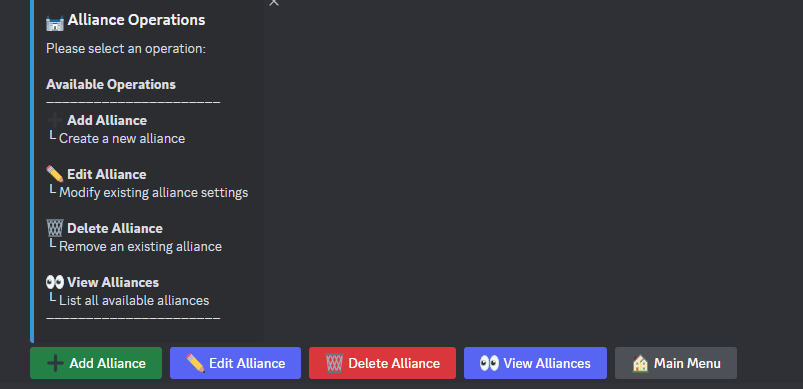
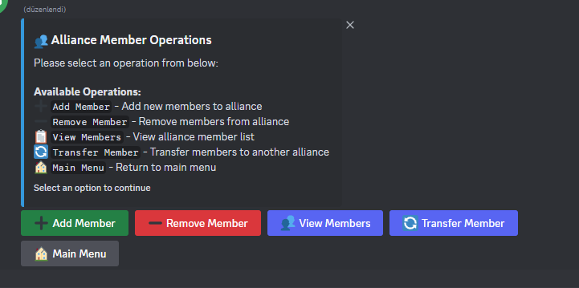
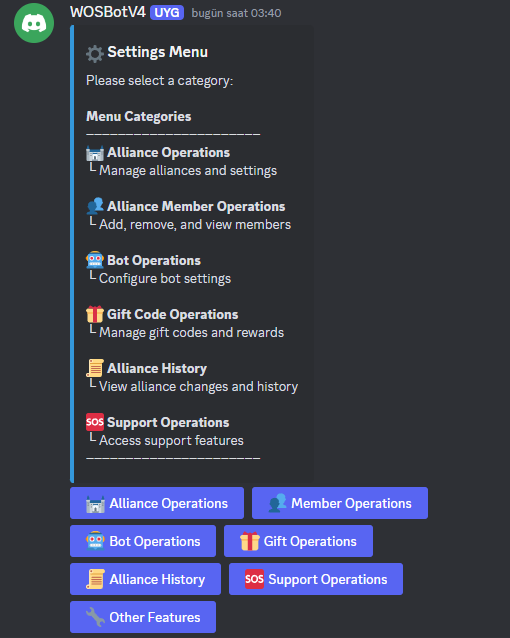
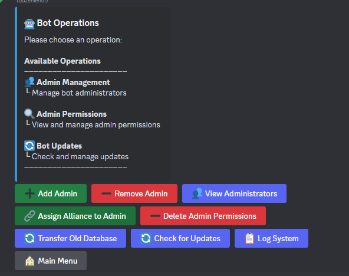
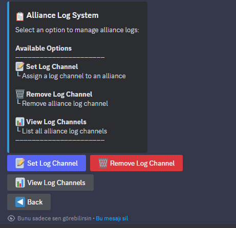
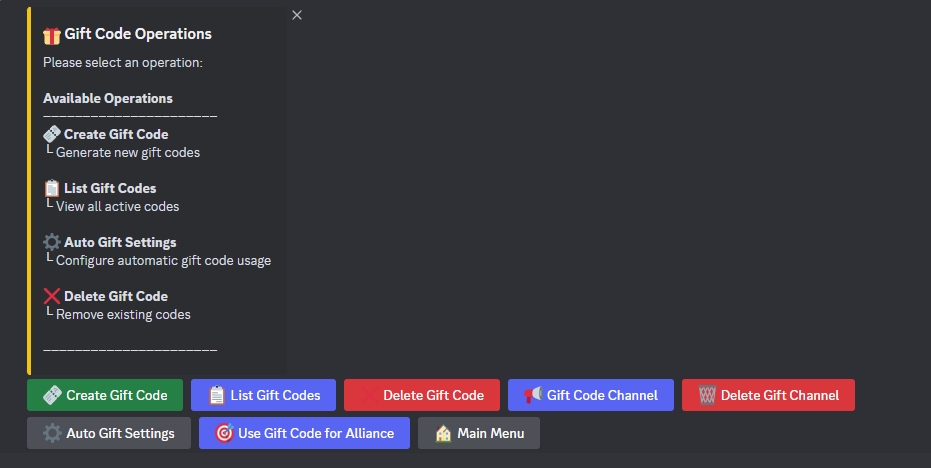
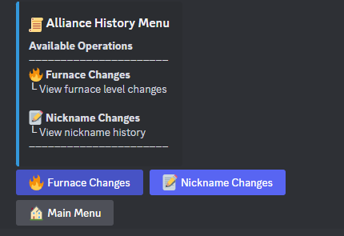
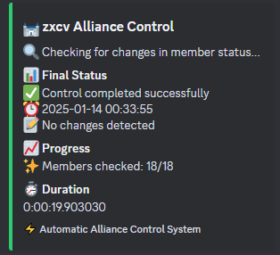
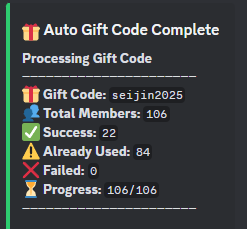
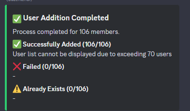
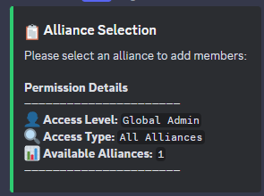

---


